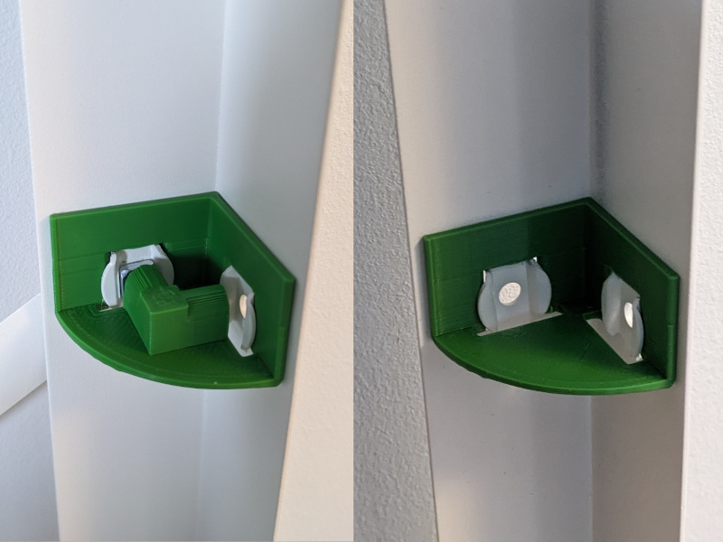
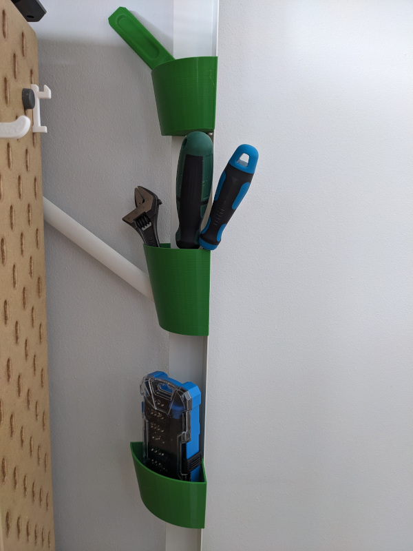
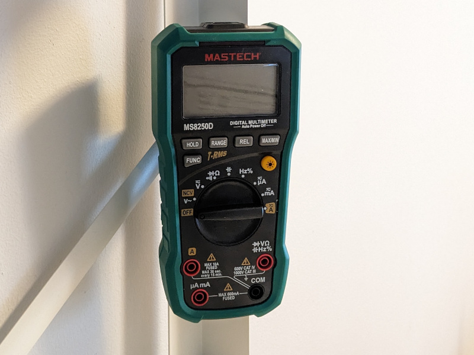

# IKEA Bror shelf systems addons

## Frame connection part

A connection part to the frame of the IKEA Bror shelf that you can use to build different variants of boxes and holders for the IKEA Bror shelf systems.

## Ikea Bror frame containers

A set of containers that fits to the Ikea Bror shelf systems.

## A Mastech multimeter (ms8250d) attachment addon

An addon that allows you to mount a Mastech multimeter. This designed fits the ms8250d model. Hopefully, it fits other Mastech models.