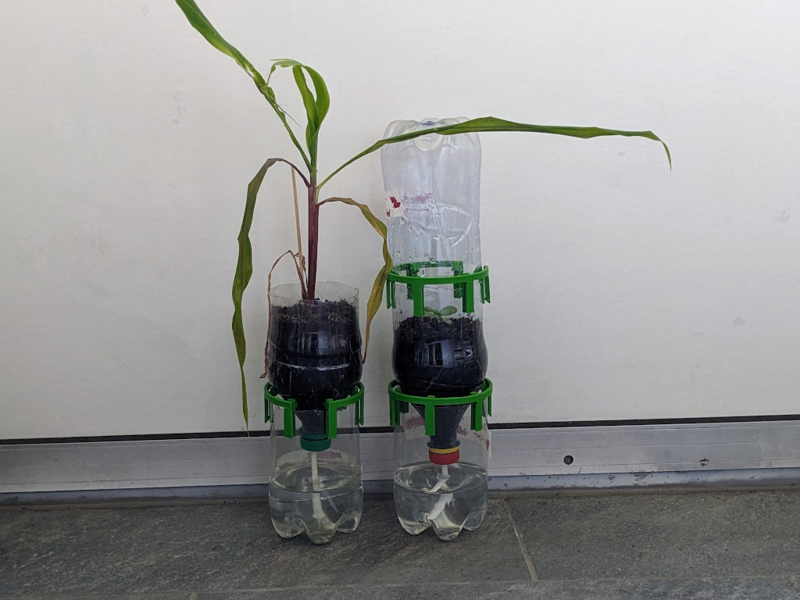

# PET self watering setup - a distance to reservoir tool

A plastic bottle (PET) can easily be turned into a self watering seed starter.

This tool can complement the basic setup by allowing fresh air to enter the reservoir part and allow for more water in the reservoir by lifting up the planting part.

The design also allows you to transform a bottom part of a bottle to a green house by placing the bottom part of the bottle on top of the planting part.

