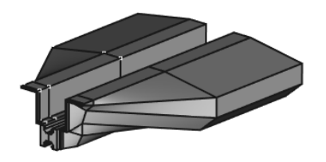
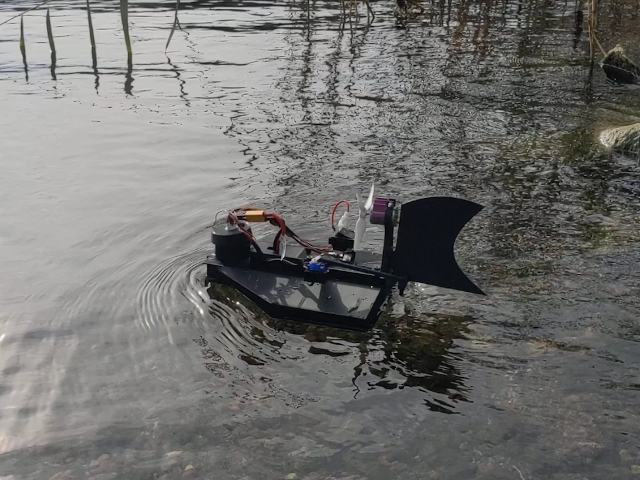

# A tnut / 2020 based frame for rc boats

Building a RC Airboat is one of the more simple RC projects that you can undertake. This particular project was inspired by [Awsome 3D Printed RC Airboat](https://www.youtube.com/watch?v=A5SU8Zp4zPE).

The wikipedia definition of an [airboat](https://en.wikipedia.org/wiki/Airboat) is:

_"An airboat (also known as a planeboat, swamp boat, bayou boat, or fanboat) is a flat-bottomed watercraft propelled by an aircraft-type propeller and powered by either an aircraft or automotive engine"_

# Disclaimer

Be carefull when building your RC vehicle and make sure that you know what you are doing. The propeller can easily hurt you, batteries may explode and start a fire etc. This model comes with no warrenty.
