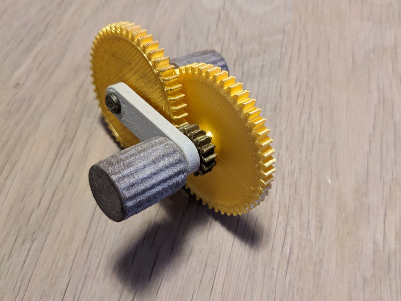

# A simple gearbox

This gearbox is designed to be as simple as possible yet usable to allow fine adjustments on a rack gear. The gearbox consists of three gears and two knobs, providing a 1 to 9,7 or 1 to 3,3 gear ratio depending on the knob used.

