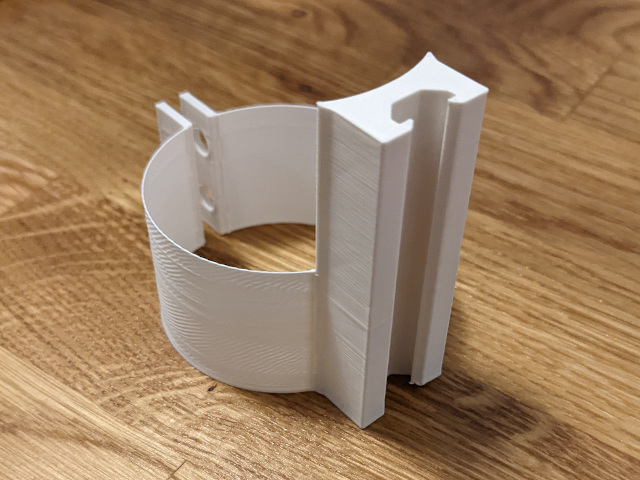

# Monitor Mount V-Slot Add-On

A v-slot add-on to your monitor mount. It was initial designed for the [Hama monitor mount](https://www.hama.com/00118490/hama-monitor-holder-height-adjustable-swivel-tilt-pull-out-13-32), but the designed is adjustable and can be adapted to other mounts.

The v-slot is base on the 2020 v-slot / t-slot standard.